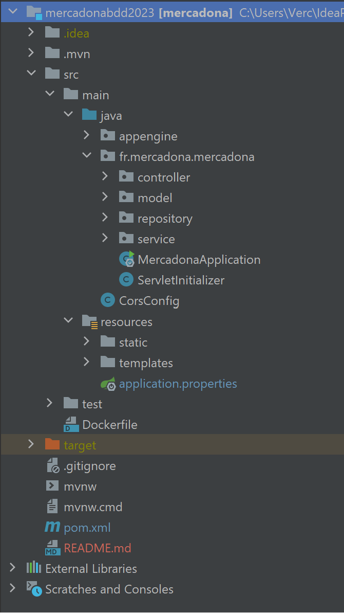

# Mercadona - Application Web PARTIE BACKEND

Bienvenue sur le site de l'application web Mercadona, développée par l'entreprise Promoweb. Notre application vous permet de découvrir les produits en cours, y compris les promotions actuelles, pour vous aider à faire des achats informés et économiques. Cette application est soutenue par une infrastructure solide, avec le back-end écrit en Java grâce à Spring Boot, une base de données PostgreSQL et un front sous Angular. Pour compiler le projet, nous utilisons l'outil Maven, et le déploiement en ligne est assuré par AWS.


## Informations pratiques

- [Lien vers le site](http://mercadonastudi.io.s3-website.eu-west-3.amazonaws.com/)
- [Repository GitHub](https://github.com/SophieVDev/mercadonabdd2023.git)
- [Manuel d'utilisation](https://drive.google.com/file/d/1wE98oEM_E2TFC21XeVg_tIZiwRXRp1lr/view?usp=sharing)
- [Documentation technique](https://drive.google.com/file/d/1B0FyR3EjUBsPI2nN6me7rQWtVJgfhhtj/view?usp=sharing)


## Structure du site

Le répertoire du projet Mercadona suit la disposition suivante :




## Technologies Utilisées

Dépendances : spring-boot-starter-thymeleaf, spring-boot-starter-actuator, spring-boot-starter-data-jpa,spring-boot-starter-validation, spring-boot-starter-web, spring-boot-devtools, postgresql, Lombok, spring-boot-starter-tomcat,
spring-boot-starter-test, swagger-ui, bootstrap, webjars-locator-core, jasypt-spring-boot-starter, jasypt-spring-boot-starter.


## Comment cloner le code


- Côté BACK ==> Cloner le repository : git clone https://github.com/SophieVDev/mercadonabdd2023.git
- Côté FRONT ==> Cloner le repository : git clone https://github.com/SophieVDev/mercadona.git


## Color Reference

| Color             | Hex                                                                |
| ----------------- | ------------------------------------------------------------------ |
| Example Color |  #0a192f |
| Example Color |  #fffff |
| Example Color |  #219e6b |


## Déploiment

Pour déployer le projet :

```bash
  npm run deploy
```

## Besoin d'Aide ?
Si vous rencontrez des problèmes ou avez des questions sur l'application, n'hésitez pas à consulter notre documentation technique ou à vous référer au manuel d'utilisation pour obtenir de l'aide.

Merci bien! 🛒

